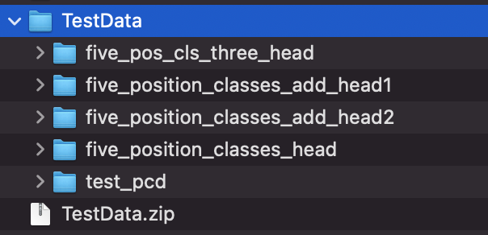
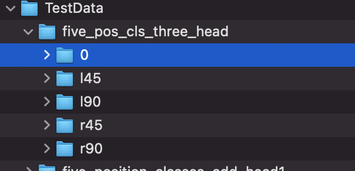
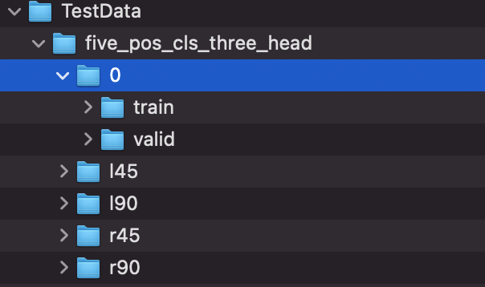
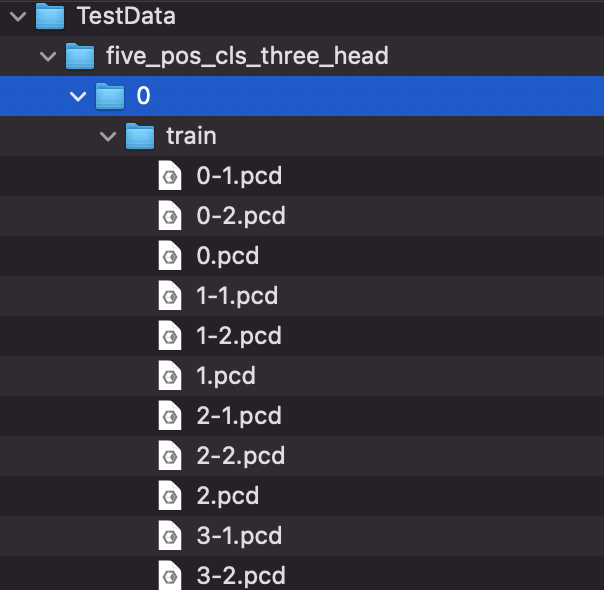
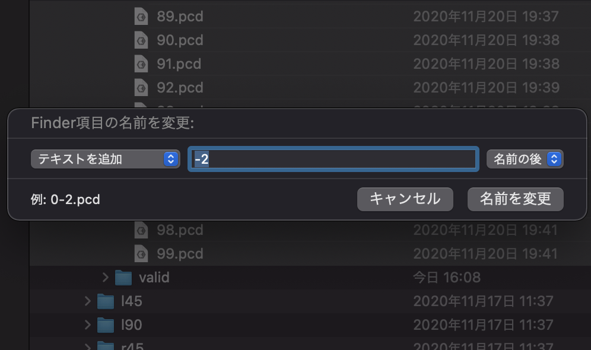

# 学習・検証用データの構造について

【注意！】
git上で本来、学習用・検証用データが入っているDataディレクトリは容量が大きいため`.gitignore`によって管理してないです。

`$ mkdir Data`でDataディレクトリを作ってデータセットをコピーするか、そのままPointNet_Regディレクトリ直下に`TestData`を解凍してください。その場合はコード上で参照するpathなどは適宜変更してください。

学習用・検証用データセットは、このDataディレクトリ以下に用意します。
こんな感じになってるといいです。

>Data
|-five_pos_cls_three_head
|-five_position_classes_add_head1
|-five_position_classes_add_head2
|-...

例として、GoogleDriveのTestDataを解凍すると、以下のようになっています。

`TestData`以下には、`five_pos_cls_three_head`とか色々ありますね。

`five_position_classes_head`、`five_position_classes_add_head1`、`five_position_classes_add_head`などはそれぞれの人(Aさん、Bさん、Cさん)の頭部データが入っています。それらをくっつけたものが`five_pos_cls_three_head`に入っています。

実験には基本的に3人分のデータが入っている`five_pos_cls_three_head`を使ってください。

試しに`five_pos_cls_three_head`の中身を見てみます。

データセット直下はこのように5つのクラスごとに分かれています。
今回はクラス分類タスクとしてデータセットを用意しているので、データセットを新しく独自で作る場合は、作る構造に合わせてコード内のサンプルの保存方法・データセットを呼び出す構造を作ってね！

`クラス0`の下は、`train`と`valid`に分かれています。
学習用と検証用ですね(単純明快)

`train`以下からようやくデータ本体が見えてきました！🎉
`0.pcd`はAさん、`0-1.pcd`はBさん、`0-2.pcd`はCさんを表しています。
ファイル名はデータの取得・保存時に、0.pcd, 1.pcd, 2.pcd...と数字だけ着くので、データセットを結合するときには名前を変えてね。
例えば、MacならFinderで名前を変えたいものを複数選択して`右クリック→名称変更`すると、こんな画面が出てきて、楽に変えることができるよ。

~~Windowsの場合はわかんないや！~~
参考:[Windows10でファイル名/フォルダ名を一括で変更する方法【連番も】](https://itojisan.xyz/settings/17549/)

